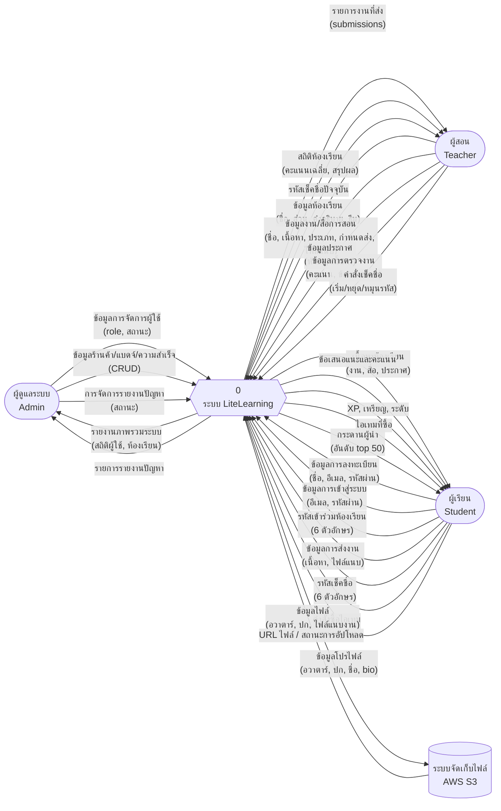
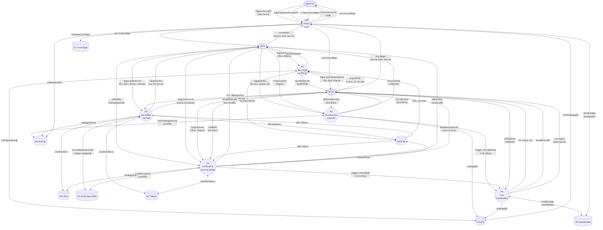

# LiteLearning — Data Flow Diagram (DFD)

> เอกสารอธิบายการไหลของข้อมูล (Data Flow Diagram) ระดับ 0 และระดับ 1 ของระบบ LiteLearning
> จัดทำตามหลักการ DFD มาตรฐาน (Yourdon & DeMarco Notation)

## สัญลักษณ์ที่ใช้ (Notation)

| สัญลักษณ์ | ความหมาย | ตัวอย่าง |
|---|---|---|
| สี่เหลี่ยม (Rectangle) | สิ่งที่อยู่ภายนอกระบบ (External Entity) | ผู้สอน, ผู้เรียน |
| วงกลม (Circle) | กระบวนการ (Process) | P1, P2, ... |
| เส้นเปิดสองด้าน (Open-ended Rectangle) | แหล่งเก็บข้อมูล (Data Store) | D1, D2, ... |
| ลูกศร (Arrow) | กระแสข้อมูล (Data Flow) | ข้อมูลการเข้าสู่ระบบ |

## 1. สิ่งที่อยู่ภายนอกระบบ (External Entities)

| รหัส | ชื่อ | คำอธิบาย |
|---|---|---|
| E1 | ผู้ดูแลระบบ (Admin) | จัดการผู้ใช้ จัดการร้านค้า แบดจ์ ความสำเร็จ และตรวจสอบรายงานปัญหา |
| E2 | ผู้สอน (Teacher) | สร้างและจัดการห้องเรียน สร้างงาน/สื่อการสอน ประกาศ ตรวจงาน และจัดการเช็คชื่อ |
| E3 | ผู้เรียน (Student) | เข้าร่วมห้องเรียน ส่งงาน เช็คชื่อ ซื้อไอเทมในร้านค้า และดูกระดานผู้นำ |
| E4 | ระบบจัดเก็บไฟล์ (AWS S3 / MinIO) | ระบบจัดเก็บไฟล์แนบ รูปอวาตาร์ และรูปปก ภายนอก |

## 2. แหล่งเก็บข้อมูล (Data Stores)

| รหัส | ชื่อ | ข้อมูลที่จัดเก็บ |
|---|---|---|
| D1 | ผู้ใช้ (Users) | บัญชีผู้ใช้ บทบาท (role) ข้อมูลโปรไฟล์ (avatar, bio, UI scale) สถานะการยืนยันอีเมล |
| D2 | ห้องเรียน (Classrooms) | รายละเอียดห้องเรียน รหัสเข้าร่วม (6 ตัวอักษร) ธีม สถานะการเก็บถาวร ตาราง pivot สมาชิก (บทบาท, วันที่เข้าร่วม) |
| D3 | เนื้อหา (Content) | งาน (assignments: ประเภท/รางวัล/กำหนดส่ง/สถานะ) สื่อการสอน (materials) ประกาศ (announcements) หัวข้อ (topics) ความคิดเห็น (comments) |
| D4 | การส่งงานและเช็คชื่อ (Submissions & Attendance) | งานที่ส่ง (submissions: สถานะ/คะแนน/ข้อเสนอแนะ) เซสชันเช็คชื่อ (attendance_sessions: รหัส/สถานะ active) |
| D5 | ไฟล์แนบ (Attachments) | ไฟล์แนบแบบ polymorphic (file_path, file_type, uploaded_by) |
| D6 | Gamification | สถิติผู้เรียน (coins/xp/level) ประวัติธุรกรรมเหรียญ สินค้าในร้าน ไอเทมที่ผู้ใช้ซื้อ ความสำเร็จ แบดจ์ |
| D7 | รายงานปัญหา (Bug Reports) | รายงานปัญหา (ประเภท/หัวข้อ/ข้อความ/สถานะ) |

## 3. DFD ระดับ 0: Context Diagram

แสดงภาพรวมระดับสูงสุดของระบบ LiteLearning โดยมีเพียง 1 กระบวนการ คือ "ระบบ LiteLearning" ที่เชื่อมต่อกับสิ่งที่อยู่ภายนอกระบบทั้งหมด

### 3.1 แผนภาพ

### 3.2 ตารางกระแสข้อมูล (Data Flow) ระดับ 0

| # | ต้นทาง | ปลายทาง | กระแสข้อมูล |
|---|---|---|---|
| 1 | ผู้ดูแลระบบ | ระบบ LiteLearning | ข้อมูลการจัดการผู้ใช้ (role, สถานะ active/inactive) |
| 2 | ผู้ดูแลระบบ | ระบบ LiteLearning | ข้อมูลร้านค้า/แบดจ์/ความสำเร็จ (สร้าง/แก้ไข/ลบ) |
| 3 | ผู้ดูแลระบบ | ระบบ LiteLearning | การจัดการรายงานปัญหา (เปลี่ยนสถานะ) |
| 4 | ระบบ LiteLearning | ผู้ดูแลระบบ | รายงานภาพรวมระบบ (สถิติผู้ใช้, ห้องเรียน, งาน) |
| 5 | ระบบ LiteLearning | ผู้ดูแลระบบ | รายการรายงานปัญหา |
| 6 | ผู้สอน | ระบบ LiteLearning | ข้อมูลห้องเรียน (ชื่อ, ส่วน, คำอธิบาย, ธีม) |
| 7 | ผู้สอน | ระบบ LiteLearning | ข้อมูลงาน/สื่อการสอน (ชื่อ, เนื้อหา, ประเภท, กำหนดส่ง, ไฟล์แนบ) |
| 8 | ผู้สอน | ระบบ LiteLearning | ข้อมูลประกาศ (หัวข้อ, เนื้อหา) |
| 9 | ผู้สอน | ระบบ LiteLearning | ข้อมูลการตรวจงาน (คะแนน, ข้อเสนอแนะ) |
| 10 | ผู้สอน | ระบบ LiteLearning | คำสั่งเช็คชื่อ (เริ่ม/หยุด/หมุนรหัส) |
| 11 | ระบบ LiteLearning | ผู้สอน | รายการงานที่ส่ง (submissions) |
| 12 | ระบบ LiteLearning | ผู้สอน | สถิติห้องเรียน (คะแนนเฉลี่ย, สรุปผล) |
| 13 | ระบบ LiteLearning | ผู้สอน | รหัสเช็คชื่อปัจจุบัน |
| 14 | ผู้เรียน | ระบบ LiteLearning | ข้อมูลการลงทะเบียน (ชื่อ, อีเมล, รหัสผ่าน) |
| 15 | ผู้เรียน | ระบบ LiteLearning | ข้อมูลการเข้าสู่ระบบ (อีเมล, รหัสผ่าน) |
| 16 | ผู้เรียน | ระบบ LiteLearning | รหัสเข้าร่วมห้องเรียน (6 ตัวอักษร) |
| 17 | ผู้เรียน | ระบบ LiteLearning | ข้อมูลการส่งงาน (เนื้อหา, ไฟล์แนบ) |
| 18 | ผู้เรียน | ระบบ LiteLearning | รหัสเช็คชื่อ (6 ตัวอักษร) |
| 19 | ผู้เรียน | ระบบ LiteLearning | คำสั่งซื้อไอเทม (รหัสสินค้า) |
| 20 | ผู้เรียน | ระบบ LiteLearning | ข้อมูลโปรไฟล์ (อวาตาร์, ปก, ชื่อ, bio) |
| 21 | ระบบ LiteLearning | ผู้เรียน | เนื้อหาห้องเรียน (งาน, สื่อ, ประกาศ) |
| 22 | ระบบ LiteLearning | ผู้เรียน | ข้อเสนอแนะและคะแนน |
| 23 | ระบบ LiteLearning | ผู้เรียน | XP, เหรียญ, ระดับ |
| 24 | ระบบ LiteLearning | ผู้เรียน | ไอเทมที่ซื้อ |
| 25 | ระบบ LiteLearning | ผู้เรียน | กระดานผู้นำ (อันดับ top 50) |
| 26 | ระบบ LiteLearning | ระบบจัดเก็บไฟล์ | ข้อมูลไฟล์ (อวาตาร์, ปก, ไฟล์แนบงาน) |
| 27 | ระบบจัดเก็บไฟล์ | ระบบ LiteLearning | URL ไฟล์ / สถานะการอัปโหลด |

---

## 4. DFD ระดับ 1: กระบวนการหลัก

แยกกระบวนการภายในระบบ LiteLearning ออกเป็น 6 กระบวนการหลัก

### 4.1 รายการกระบวนการ

| รหัส | ชื่อกระบวนการ | คำอธิบาย |
|---|---|---|
| P1 | จัดการบัญชีและโปรไฟล์ (Account & Profile) | การลงทะเบียน เข้าสู่ระบบ ยืนยันอีเมล ตั้งค่าบทบาท และแก้ไขโปรไฟล์ |
| P2 | จัดการห้องเรียนและสมาชิก (Classroom & Members) | สร้างห้องเรียน เข้าร่วมด้วยรหัส จัดการสมาชิก ตั้งค่าห้อง และจัดการ sidebar |
| P3 | จัดการเนื้อหาการเรียนรู้ (Content Management) | สร้าง/แก้ไข/ลบ งาน สื่อการสอน ประกาศ หัวข้อ และความคิดเห็น |
| P4 | การมีส่วนร่วมและการประเมินผล (Participation & Assessment) | ส่งงาน เช็คชื่อ ตรวจงาน ให้คะแนน และสรุปผลการเรียน |
| P5 | ระบบ Gamification (Gamification & Rewards) | คำนวณ XP/เหรียญ เลื่อนระดับ ร้านค้า ความสำเร็จ แบดจ์ และกระดานผู้นำ |
| P6 | การดูแลระบบ (System Administration) | จัดการผู้ใช้ ร้านค้า แบดจ์ ความสำเร็จ รายงานปัญหา และภาพรวมระบบ |

### 4.2 แผนภาพ

### 4.3 ตารางกระแสข้อมูล (Data Flow) ระดับ 1

#### P1: จัดการบัญชีและโปรไฟล์ (Account & Profile)

| # | ต้นทาง | ปลายทาง | กระแสข้อมูล |
|---|---|---|---|
| 1.1 | ผู้สอน / ผู้เรียน | P1 | ข้อมูลการลงทะเบียน (ชื่อ, อีเมล, รหัสผ่าน) |
| 1.2 | ผู้สอน / ผู้เรียน | P1 | ข้อมูลการเข้าสู่ระบบ (อีเมล, รหัสผ่าน) |
| 1.3 | ผู้เรียน | P1 | การเลือกบทบาท (Setup Flow) |
| 1.4 | ผู้สอน / ผู้เรียน | P1 | ข้อมูลโปรไฟล์ (อวาตาร์ Base64, รูปปก, ชื่อแสดง, bio, UI scale) |
| 1.5 | P1 | ผู้สอน / ผู้เรียน | ผลการยืนยันตัวตน (สำเร็จ/ล้มเหลว) |
| 1.6 | P1 | ผู้สอน / ผู้เรียน | ข้อมูลโปรไฟล์ปัจจุบัน |
| 1.7 | P1 | D1 (ผู้ใช้) | สร้าง/อัปเดตข้อมูลบัญชี |
| 1.8 | D1 (ผู้ใช้) | P1 | ข้อมูลบัญชีสำหรับยืนยันตัวตน |
| 1.9 | P1 | AWS S3 | อัปโหลดไฟล์อวาตาร์/ปก |
| 1.10 | AWS S3 | P1 | URL ไฟล์อวาตาร์/ปก |

#### P2: จัดการห้องเรียนและสมาชิก (Classroom & Members)

| # | ต้นทาง | ปลายทาง | กระแสข้อมูล |
|---|---|---|---|
| 2.1 | ผู้สอน | P2 | ข้อมูลห้องเรียนใหม่ (ชื่อ, ส่วน, คำอธิบาย, ธีม) |
| 2.2 | ผู้สอน | P2 | ข้อมูลการตั้งค่าห้องเรียน (แก้ไข/เก็บถาวร/ลบ) |
| 2.3 | ผู้สอน | P2 | คำสั่งจัดการสมาชิก (เชิญผู้ช่วยสอน/ลบสมาชิก) |
| 2.4 | ผู้เรียน | P2 | รหัสเข้าร่วมห้องเรียน (6 ตัวอักษร) |
| 2.5 | P2 | ผู้สอน | รายการห้องเรียน รายชื่อสมาชิก |
| 2.6 | P2 | ผู้เรียน | รายการห้องเรียน ผลการเข้าร่วม (สำเร็จ/รหัสไม่ถูก) |
| 2.7 | P2 | D2 (ห้องเรียน) | สร้าง/อัปเดตข้อมูลห้องเรียน สร้าง/ลบ pivot สมาชิก |
| 2.8 | D2 (ห้องเรียน) | P2 | ข้อมูลห้องเรียน รายชื่อสมาชิก ตรวจสอบรหัส |
| 2.9 | D1 (ผู้ใช้) | P2 | ข้อมูลผู้ใช้สำหรับค้นหาสมาชิก |
| 2.10 | P2 | P5 | Trigger: ผู้เรียนเข้าร่วมห้องเรียน (+15 เหรียญ) |

#### P3: จัดการเนื้อหาการเรียนรู้ (Content Management)

| # | ต้นทาง | ปลายทาง | กระแสข้อมูล |
|---|---|---|---|
| 3.1 | ผู้สอน | P3 | ข้อมูลงาน (ชื่อ, คำอธิบาย, ประเภท, คะแนนเต็ม, รางวัล XP/เหรียญ, กำหนดส่ง, ไฟล์แนบ) |
| 3.2 | ผู้สอน | P3 | ข้อมูลสื่อการสอน (ชื่อ, คำอธิบาย, หัวข้อ, ไฟล์แนบ) |
| 3.3 | ผู้สอน | P3 | ข้อมูลประกาศ (หัวข้อ, เนื้อหา) |
| 3.4 | ผู้สอน / ผู้เรียน | P3 | ความคิดเห็น (ข้อความ) |
| 3.5 | P3 | ผู้สอน / ผู้เรียน | เนื้อหาห้องเรียน (งาน, สื่อ, ประกาศ, ความคิดเห็น) |
| 3.6 | P3 | D3 (เนื้อหา) | สร้าง/อัปเดต/ลบ งาน สื่อ ประกาศ หัวข้อ ความคิดเห็น |
| 3.7 | D3 (เนื้อหา) | P3 | ข้อมูลเนื้อหาทั้งหมด |
| 3.8 | P3 | D5 (ไฟล์แนบ) | บันทึกข้อมูลไฟล์แนบ (polymorphic) |
| 3.9 | P3 | AWS S3 | อัปโหลดไฟล์แนบ |
| 3.10 | AWS S3 | P3 | URL ไฟล์แนบ |
| 3.11 | D2 (ห้องเรียน) | P3 | ข้อมูลห้องเรียนและสมาชิก |
| 3.12 | P3 | D4 (การส่งงาน) | สร้าง Submission เริ่มต้นสำหรับผู้เรียนทุกคน (status: assigned) |

#### P4: การมีส่วนร่วมและการประเมินผล (Participation & Assessment)

| # | ต้นทาง | ปลายทาง | กระแสข้อมูล |
|---|---|---|---|
| 4.1 | ผู้เรียน | P4 | ข้อมูลการส่งงาน (เนื้อหา, ไฟล์แนบ) |
| 4.2 | ผู้เรียน | P4 | รหัสเช็คชื่อ (6 ตัวอักษร) |
| 4.3 | ผู้สอน | P4 | คำสั่งเช็คชื่อ (เริ่ม session/หยุด/หมุนรหัส) |
| 4.4 | ผู้สอน | P4 | ข้อมูลการตรวจงาน (คะแนน, ข้อเสนอแนะ, สถานะ: graded/returned) |
| 4.5 | P4 | ผู้เรียน | ข้อเสนอแนะ คะแนน สถานะการส่งงาน |
| 4.6 | P4 | ผู้สอน | รายการงานที่ส่ง รหัสเช็คชื่อปัจจุบัน คะแนนเฉลี่ย |
| 4.7 | P4 | D4 (การส่งงาน) | อัปเดต submission (status, score, feedback, turned_in_at, graded_at) สร้าง/อัปเดต attendance session |
| 4.8 | D4 (การส่งงาน) | P4 | ข้อมูล submission และ attendance session |
| 4.9 | P4 | D5 (ไฟล์แนบ) | บันทึกไฟล์แนบที่ผู้เรียนส่ง |
| 4.10 | D3 (เนื้อหา) | P4 | ข้อมูลงาน (คะแนนเต็ม, ประเภท, กำหนดส่ง) |
| 4.11 | P4 | AWS S3 | อัปโหลดไฟล์งานที่ส่ง |
| 4.12 | AWS S3 | P4 | URL ไฟล์งาน |
| 4.13 | P4 | P5 | Trigger: ผู้เรียนส่งงาน/เช็คชื่อ (+10 เหรียญ) |

#### P5: ระบบ Gamification (Gamification & Rewards)

| # | ต้นทาง | ปลายทาง | กระแสข้อมูล |
|---|---|---|---|
| 5.1 | P2 | P5 | Trigger: เข้าร่วมห้องเรียน (+15 เหรียญ) |
| 5.2 | P4 | P5 | Trigger: ส่งงาน/เช็คชื่อ (+10 เหรียญ) |
| 5.3 | ผู้เรียน | P5 | คำสั่งซื้อไอเทม (รหัสสินค้า) |
| 5.4 | ผู้เรียน | P5 | คำสั่งสวมใส่/ถอดไอเทม |
| 5.5 | P5 | ผู้เรียน | XP, เหรียญ, ระดับปัจจุบัน |
| 5.6 | P5 | ผู้เรียน | ไอเทมที่ซื้อ/สวมใส่ |
| 5.7 | P5 | ผู้เรียน | กระดานผู้นำ (อันดับ top 50 ตาม Level/XP) |
| 5.8 | P5 | ผู้เรียน | ความสำเร็จและแบดจ์ |
| 5.9 | P5 | D6 (Gamification) | อัปเดต XP/เหรียญ/ระดับ บันทึกธุรกรรม สร้าง/อัปเดต pivot ไอเทม ปลดล็อกความสำเร็จ/แบดจ์ |
| 5.10 | D6 (Gamification) | P5 | ข้อมูล XP/เหรียญ/ระดับ รายการสินค้า ไอเทมที่ซื้อ ความสำเร็จ แบดจ์ |
| 5.11 | D1 (ผู้ใช้) | P5 | ข้อมูลผู้ใช้สำหรับกระดานผู้นำ |

#### P6: การดูแลระบบ (System Administration)

| # | ต้นทาง | ปลายทาง | กระแสข้อมูล |
|---|---|---|---|
| 6.1 | ผู้ดูแลระบบ | P6 | ข้อมูลการจัดการผู้ใช้ (เปลี่ยน role, เปิด/ปิดสถานะ) |
| 6.2 | ผู้ดูแลระบบ | P6 | ข้อมูลสินค้าในร้านค้า (สร้าง/แก้ไข/ลบ: ชื่อ, ราคา, ประเภท, ข้อมูล) |
| 6.3 | ผู้ดูแลระบบ | P6 | ข้อมูลแบดจ์ (สร้าง/แก้ไข/ลบ: ชื่อ, ไอคอน, สี) |
| 6.4 | ผู้ดูแลระบบ | P6 | ข้อมูลความสำเร็จ (สร้าง/แก้ไข/ลบ: ชื่อ, เกณฑ์, รางวัล) |
| 6.5 | ผู้ดูแลระบบ | P6 | การจัดการรายงานปัญหา (เปลี่ยนสถานะ: resolved/open) |
| 6.6 | ผู้สอน / ผู้เรียน | P6 | รายงานปัญหา (ประเภท, หัวข้อ, ข้อความ) |
| 6.7 | P6 | ผู้ดูแลระบบ | รายงานภาพรวมระบบ (จำนวนผู้ใช้, ห้องเรียน, งาน) |
| 6.8 | P6 | ผู้ดูแลระบบ | รายการผู้ใช้ รายการรายงานปัญหา |
| 6.9 | P6 | ผู้สอน / ผู้เรียน | ผลการรายงานปัญหา (บันทึกสำเร็จ) |
| 6.10 | P6 | D1 (ผู้ใช้) | อัปเดต role/สถานะผู้ใช้ |
| 6.11 | D1 (ผู้ใช้) | P6 | รายการผู้ใช้ทั้งหมด |
| 6.12 | P6 | D6 (Gamification) | สร้าง/อัปเดต/ลบ สินค้า แบดจ์ ความสำเร็จ |
| 6.13 | D6 (Gamification) | P6 | รายการสินค้า แบดจ์ ความสำเร็จ |
| 6.14 | P6 | D7 (รายงานปัญหา) | สร้าง/อัปเดตรายงานปัญหา |
| 6.15 | D7 (รายงานปัญหา) | P6 | รายการรายงานปัญหาทั้งหมด |
| 6.16 | D2 (ห้องเรียน) | P6 | ข้อมูลห้องเรียนสำหรับภาพรวม |
