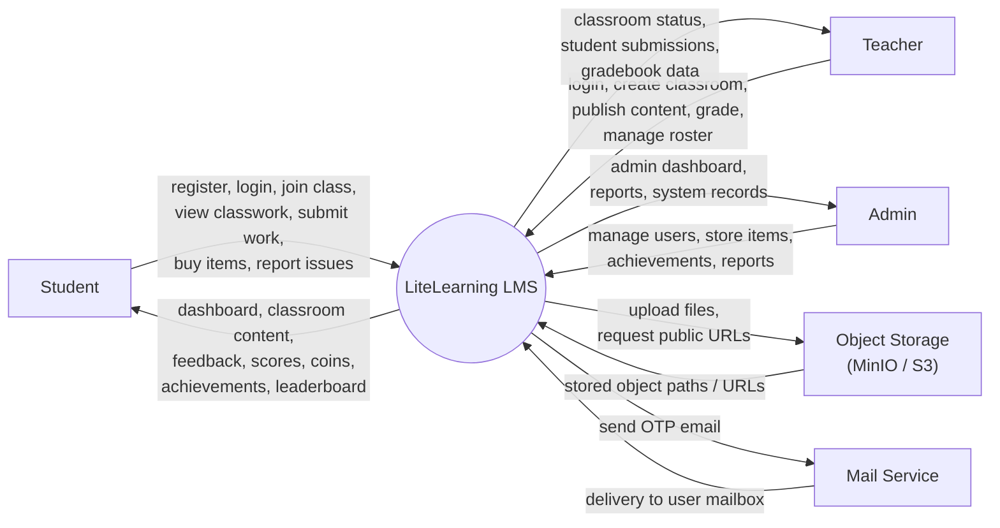
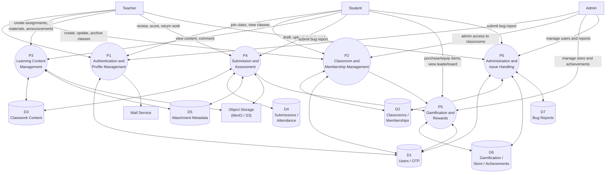
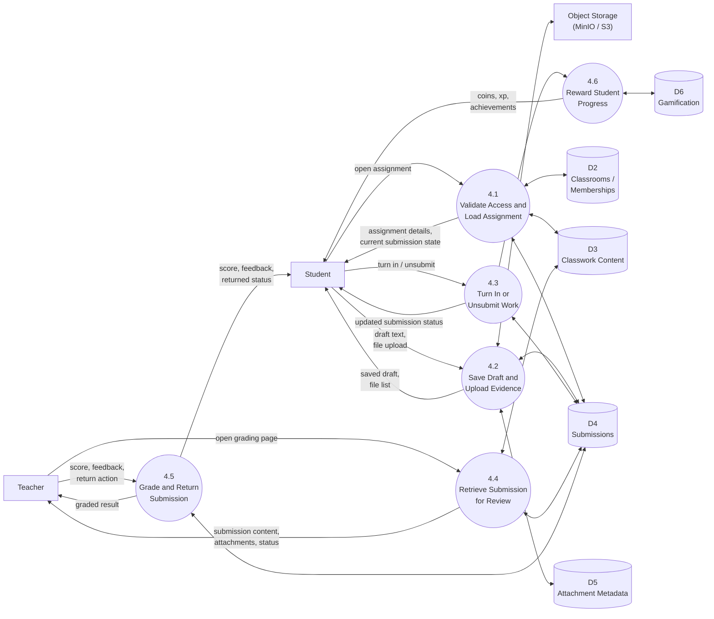

# LiteLearning Data Flow Diagram

This document summarizes the system data flow for the current LiteLearning codebase.

The diagrams are based on the project routes, Livewire components, Eloquent models, and services currently implemented in this repository.

## Scope

Main sources used for this DFD:

- `routes/web.php`
- `app/Livewire/Auth/*`
- `app/Livewire/Classroom/*`
- `app/Livewire/Assignment/*`
- `app/Livewire/Material/*`
- `app/Livewire/Student/*`
- `app/Livewire/Admin/*`
- `app/Models/*`
- `app/Services/GamificationService.php`

## External Entities

- `E1 Student`
- `E2 Teacher`
- `E3 Admin`
- `E4 Object Storage (MinIO / S3)`
- `E5 Mail Service`

## Data Stores

- `D1 Users / OTP Verification`
- `D2 Classrooms / Memberships`
- `D3 Classwork Content`
  Includes `classwork_items`, `assignments`, `materials`, `announcements`, and `topics`.
- `D4 Submissions / Attendance`
- `D5 Attachment Metadata`
- `D6 Gamification / Store / Achievements`
- `D7 Bug Reports`

## Level 0

Level 0 shows LiteLearning as one system interacting with external actors and services.

## Level 1

Level 1 decomposes the LMS into its major business processes.

### Process List

- `P1 Authentication and Profile Management`
- `P2 Classroom and Membership Management`
- `P3 Learning Content Management`
- `P4 Submission and Assessment`
- `P5 Gamification and Rewards`
- `P6 Administration and Issue Handling`

### Level 1 Process Meaning

#### P1 Authentication and Profile Management

- Handles login with rate limiting.
- Handles registration with OTP verification.
- Stores user records and profile updates.
- Uploads avatar and cover images through object storage.

#### P2 Classroom and Membership Management

- Teacher creates classrooms.
- Student joins classrooms using a 6-character code.
- System checks access and role membership.
- Classroom membership events can trigger gamification rewards.

#### P3 Learning Content Management

- Teacher creates assignments, materials, and announcements.
- Classwork is organized through `classwork_items` and optional topics.
- Files are uploaded to S3/MinIO and attachment metadata is stored in the database.
- Published content is retrieved for classroom stream and work pages.

#### P4 Submission and Assessment

- Student creates drafts, uploads submission files, and turns in work.
- Teacher reviews submissions, assigns scores, and returns work.
- Submission status and feedback are stored for dashboards and grade views.

#### P5 Gamification and Rewards

- Awards coins and XP for student actions.
- Unlocks achievements.
- Supports store purchases, item equip, and leaderboard display.

#### P6 Administration and Issue Handling

- Admin manages users, store items, achievements, and bug reports.
- Students and teachers can submit bug reports.
- Admin reads system-wide operational data from core stores.

## Level 2

This Level 2 diagram decomposes `P4 Submission and Assessment`, because it is the main transactional process in the LMS.

### Level 2 Narrative

#### 4.1 Validate Access and Load Assignment

- Checks that the assignment belongs to the classroom.
- Checks that the user can access the classroom.
- Loads the current submission record for the student if it already exists.

#### 4.2 Save Draft and Upload Evidence

- Creates or updates the student submission record.
- Stores submission files in object storage.
- Stores file metadata in the attachments table.

#### 4.3 Turn In or Unsubmit Work

- Changes submission state between `assigned` and `turned_in`.
- Writes submission timestamps.
- Sends reward trigger only when a first valid turn-in happens.

#### 4.4 Retrieve Submission for Review

- Loads submission, assignment, and user data for the teacher.
- Supports classroom-level grading and review screens.

#### 4.5 Grade and Return Submission

- Stores score, feedback, grading timestamp, and returned status.
- Makes the assessed result visible to the student.

#### 4.6 Reward Student Progress

- Awards coins and XP for turn-in events.
- Unlocks achievements when rule thresholds are reached.

## Code Mapping

These files are the main implementation points behind the diagrams:

- Authentication: `app/Livewire/Auth/Login.php`, `app/Livewire/Auth/Register.php`
- Classroom lifecycle: `app/Livewire/Classroom/Create.php`, `app/Livewire/Classroom/JoinClassroom.php`, `app/Livewire/Classroom/Show.php`, `app/Livewire/Classroom/Work.php`
- Content lifecycle: `app/Livewire/Assignment/Create.php`, `app/Livewire/Material/Create.php`
- Submission and grading: `app/Livewire/Assignment/Show.php`, `app/Livewire/Assignment/Grade.php`
- Profile and files: `app/Livewire/Profile.php`
- Gamification: `app/Services/GamificationService.php`, `app/Livewire/Student/*`
- Administration: `app/Livewire/Admin/*`, `app/Livewire/ReportBug.php`
