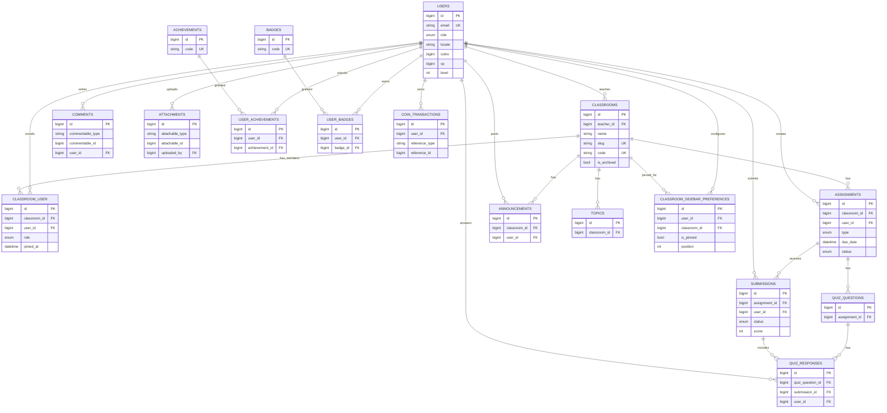
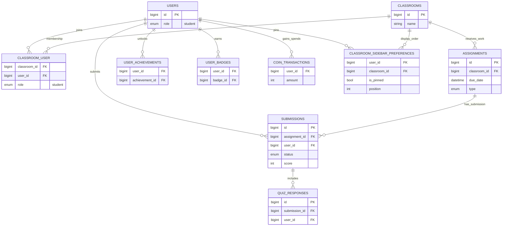
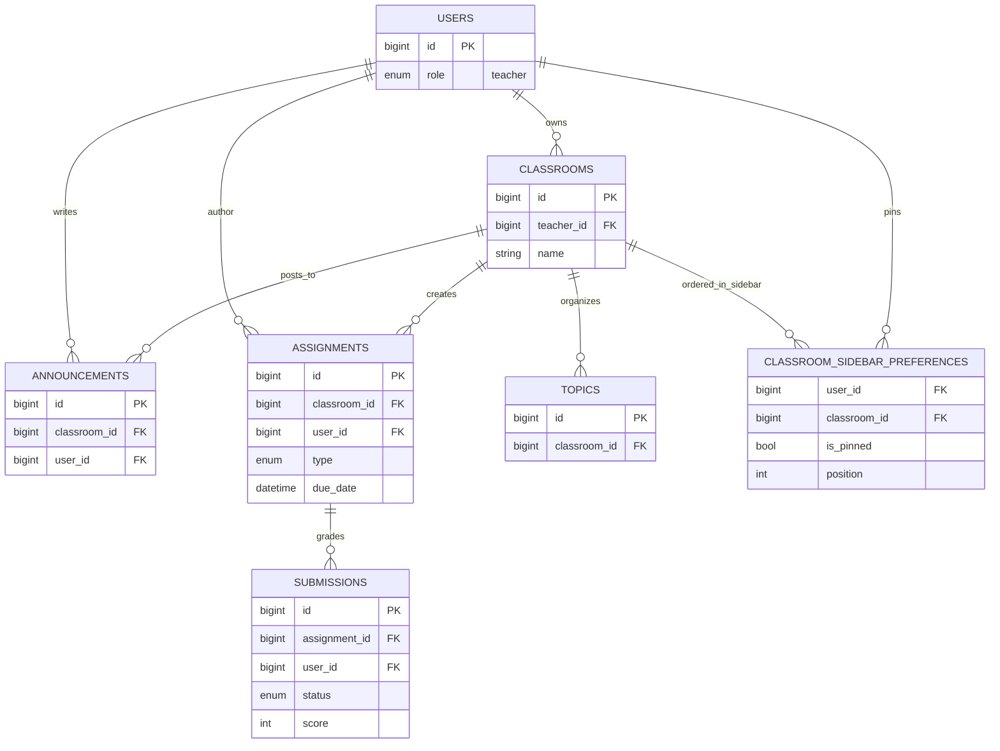
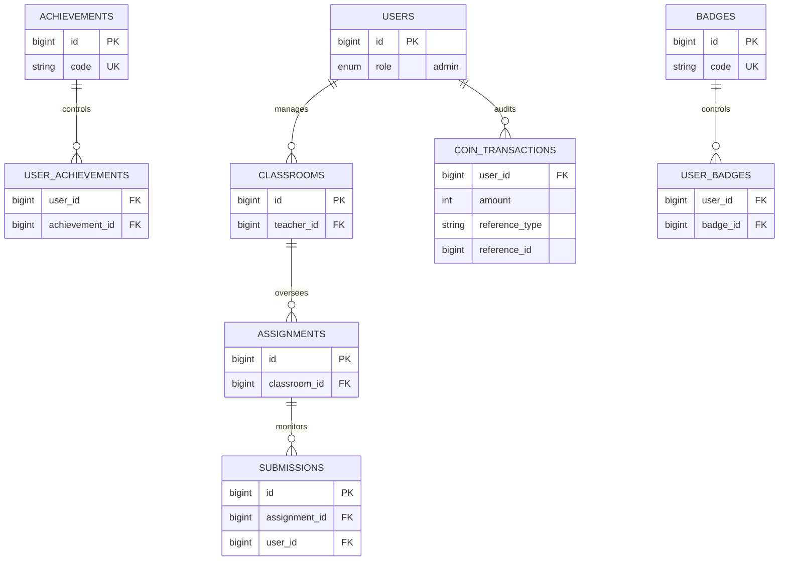

# LiteLearning ER Role Views

> This document keeps the real schema (`users` + `role`) but separates diagrams by role perspective for readability.

## 1) Core (Actual Schema)

## 2) Student View (Logical)

## 3) Teacher View (Logical)

## 4) Admin View (Logical)

## Notes

- Physical DB remains single-table users with `role`.
- Role views are for communication/readability, not separate schemas.
- `comments` / `attachments` and `coin_transactions.reference_*` are polymorphic-like and intentionally simplified in role views.
