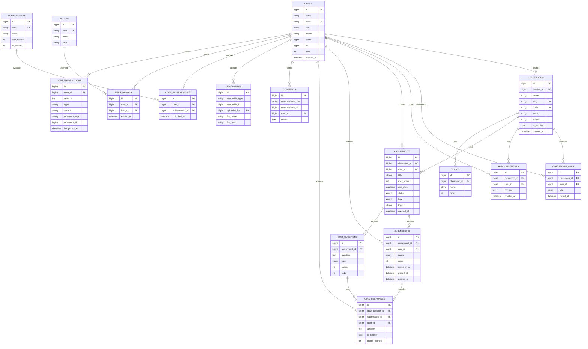

# LiteLearning ER Diagram

## Notes

- `comments` and `attachments` are polymorphic (`commentable_type/commentable_id`, `attachable_type/attachable_id`), so their parent can be more than one table.
- `coin_transactions.reference_type/reference_id` is a generic reference (polymorphic-like), not a fixed foreign key.
- Diagram is based on current migrations in `database/migrations`.
