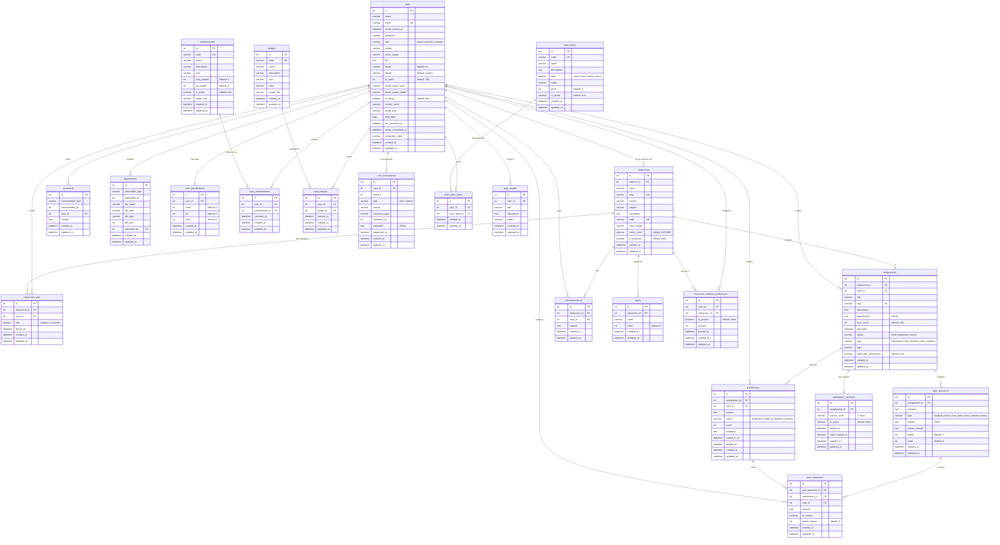

# LiteLearning — Entity Relationship Diagram

```mermaid
erDiagram
    users {
        int id PK
        varchar name
        varchar email UK
        datetime email_verified_at
        varchar password
        varchar role "admin | teacher | student"
        varchar avatar
        varchar cover_image
        text bio
        varchar locale "default: en"
        varchar theme "default: system"
        int ui_scale "default: 100"
        varchar active_name_color
        varchar active_avatar_frame
        boolean is_active "default: true"
        varchar school_name
        varchar study_year
        date birth_date
        datetime tos_accepted_at
        datetime setup_completed_at
        varchar remember_token
        datetime created_at
        datetime updated_at
    }

    classrooms {
        int id PK
        int teacher_id FK
        varchar name
        varchar slug UK
        varchar section
        varchar subject
        text description
        varchar code UK
        varchar cover_image
        varchar theme_color "default: #4F46E5"
        boolean is_archived "default: false"
        datetime created_at
        datetime updated_at
    }

    classroom_user {
        int id PK
        int classroom_id FK
        int user_id FK
        varchar role "student | co-teacher"
        datetime joined_at
        datetime created_at
        datetime updated_at
    }

    assignments {
        int id PK
        int classroom_id FK
        int user_id FK
        varchar title
        varchar slug UK
        text description
        text attachments "JSON"
        int max_score "default: 100"
        datetime due_date
        varchar status "draft | published | closed"
        varchar type "attendance | file | question | quiz | material"
        varchar topic
        boolean allow_late_submission "default: true"
        datetime created_at
        datetime updated_at
    }

    submissions {
        int id PK
        int assignment_id FK
        int user_id FK
        text content
        varchar status "assigned | turned_in | graded | returned"
        int score
        text feedback
        datetime turned_in_at
        datetime graded_at
        datetime created_at
        datetime updated_at
    }

    announcements {
        int id PK
        int classroom_id FK
        int user_id FK
        text content
        datetime created_at
        datetime updated_at
    }

    comments {
        int id PK
        varchar commentable_type
        int commentable_id
        int user_id FK
        text content
        datetime created_at
        datetime updated_at
    }

    attachments {
        int id PK
        varchar attachable_type
        int attachable_id
        varchar file_name
        varchar file_path
        varchar file_type
        int file_size
        int uploaded_by FK
        datetime created_at
        datetime updated_at
    }

    topics {
        int id PK
        int classroom_id FK
        varchar name
        int order "default: 0"
        datetime created_at
        datetime updated_at
    }

    quiz_questions {
        int id PK
        int assignment_id FK
        text question
        varchar type "multiple_choice | true_false | short_answer | essay"
        text options "JSON"
        text correct_answer
        int points "default: 1"
        int order "default: 0"
        datetime created_at
        datetime updated_at
    }

    quiz_responses {
        int id PK
        int quiz_question_id FK
        int submission_id FK
        int user_id FK
        text answer
        boolean is_correct
        int points_earned "default: 0"
        datetime created_at
        datetime updated_at
    }

    attendance_sessions {
        int id PK
        int assignment_id FK
        varchar current_code "6 chars"
        boolean is_active "default: false"
        datetime started_at
        datetime code_rotated_at
        datetime created_at
        datetime updated_at
    }

    user_gamifications {
        int id PK
        int user_id FK
        int coins "default: 0"
        int xp "default: 0"
        int level "default: 1"
        datetime created_at
        datetime updated_at
    }

    achievements {
        int id PK
        varchar code UK
        varchar name
        varchar description
        varchar icon
        int coin_reward "default: 0"
        int xp_reward "default: 0"
        boolean is_active "default: true"
        varchar target_role
        datetime created_at
        datetime updated_at
    }

    badges {
        int id PK
        varchar code UK
        varchar name
        varchar description
        varchar icon
        varchar color
        varchar target_role
        datetime created_at
        datetime updated_at
    }

    user_achievements {
        int id PK
        int user_id FK
        int achievement_id FK
        datetime unlocked_at
        datetime created_at
        datetime updated_at
    }

    user_badges {
        int id PK
        int user_id FK
        int badge_id FK
        datetime earned_at
        datetime created_at
        datetime updated_at
    }

    coin_transactions {
        int id PK
        int user_id FK
        int amount
        varchar type "earn | spend"
        varchar source
        varchar reference_type
        int reference_id
        text metadata "JSON"
        datetime happened_at
        datetime created_at
        datetime updated_at
    }

    store_items {
        int id PK
        varchar code UK
        varchar name
        text description
        varchar type "name_color | avatar_frame"
        varchar value
        int price "default: 0"
        boolean is_active "default: true"
        datetime created_at
        datetime updated_at
    }

    user_store_items {
        int id PK
        int user_id FK
        int store_item_id FK
        datetime created_at
        datetime updated_at
    }

    bug_reports {
        int id PK
        int user_id FK
        varchar title
        text description
        varchar status
        datetime created_at
        datetime updated_at
    }

    classroom_sidebar_preferences {
        int id PK
        int user_id FK
        int classroom_id FK
        boolean is_pinned "default: false"
        int position
        datetime pinned_at
        datetime created_at
        datetime updated_at
    }

    %% ─── Relationships ───

    users ||--o{ classrooms : "owns (teacher_id)"
    users ||--o{ classroom_user : "enrolls"
    classrooms ||--o{ classroom_user : "has members"

    classrooms ||--o{ assignments : "contains"
    users ||--o{ assignments : "creates"
    classrooms ||--o{ announcements : "has"
    users ||--o{ announcements : "posts"
    classrooms ||--o{ topics : "organizes"

    assignments ||--o{ submissions : "receives"
    users ||--o{ submissions : "submits"

    assignments ||--o{ quiz_questions : "contains"
    quiz_questions ||--o{ quiz_responses : "receives"
    submissions ||--o{ quiz_responses : "links"
    users ||--o{ quiz_responses : "answers"

    assignments ||--|| attendance_sessions : "has session"

    users ||--o{ comments : "writes"
    users ||--o{ attachments : "uploads"

    users ||--|| user_gamifications : "has stats"
    users ||--o{ coin_transactions : "earns/spends"

    users ||--o{ user_achievements : "unlocks"
    achievements ||--o{ user_achievements : "achieved by"
    users ||--o{ user_badges : "earns"
    badges ||--o{ user_badges : "awarded to"

    users ||--o{ user_store_items : "owns"
    store_items ||--o{ user_store_items : "purchased by"

    users ||--o{ bug_reports : "reports"
    users ||--o{ classroom_sidebar_preferences : "configures"
    classrooms ||--o{ classroom_sidebar_preferences : "pinned in"
```
