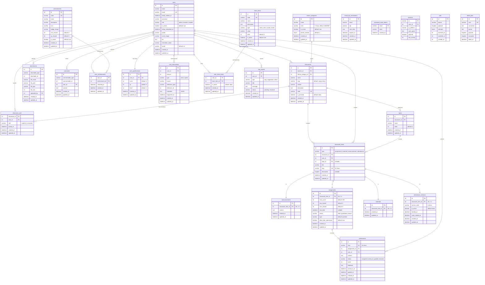

# LiteLearning — Entity Relationship Diagram

```mermaid
erDiagram
    users {
        int id PK
        varchar name
        varchar email UK
        datetime email_verified_at
        varchar password
        varchar role "admin | teacher | student"
        boolean is_active "default: true"
        datetime setup_completed_at
        varchar avatar
        varchar cover_image
        text bio
        varchar remember_token
        varchar locale "default: en"
        datetime created_at
        datetime updated_at
    }

    theme_categories {
        int id PK
        varchar name
        varchar color "7 chars, default: #6B3FBF"
        boolean is_active "default: true"
        tinyint planet_number "default: 1"
        datetime created_at
        datetime updated_at
    }

    classrooms {
        int id PK
        int teacher_id FK
        int theme_category_id FK
        varchar name
        varchar slug "default: empty string"
        varchar section
        text description
        varchar code UK
        boolean is_archived "default: false"
        datetime created_at
        datetime updated_at
    }

    classroom_user {
        int classroom_id FK
        int user_id FK
        varchar role "student | co-teacher"
        datetime joined_at
        datetime created_at
        datetime updated_at
    }

    topics {
        int id PK
        int classroom_id FK
        varchar name
        int order "default: 0"
        datetime created_at
        datetime updated_at
    }

    announcements {
        int id PK
        int classwork_item_id FK "UK, 1:1"
        text content
        datetime created_at
        datetime updated_at
    }

    classwork_items {
        int id PK
        varchar type "assignment | material | announcement | attendance"
        int classroom_id FK
        int user_id FK
        int topic_id FK "nullable"
        varchar title
        varchar slug UK "32 chars"
        longtext description "nullable"
        datetime created_at
        datetime updated_at
    }

    assignments {
        int id PK
        int classwork_item_id FK "UK, 1:1"
        int max_score "default: 100"
        int exp_reward "default: 0"
        int coin_reward "default: 0"
        datetime due_date "nullable"
        varchar status "draft | published | closed"
        varchar type "default: question"
        boolean allow_late_submission "default: true"
        datetime created_at
        datetime updated_at
    }

    materials {
        int id PK
        int classwork_item_id FK "UK, 1:1"
        datetime created_at
        datetime updated_at
    }

    attachments {
        int id PK
        varchar attachable_type
        int attachable_id
        varchar file_name
        varchar file_path
        varchar file_type
        int file_size
        int uploaded_by FK
        datetime created_at
        datetime updated_at
    }

    submissions {
        int id PK
        varchar slug UK "16 chars"
        int assignment_id FK
        int user_id FK
        text content
        varchar status "assigned | turned_in | graded | returned"
        int score
        text feedback
        datetime turned_in_at
        datetime graded_at
        datetime created_at
        datetime updated_at
    }

    attendance_sessions {
        int id PK
        int classwork_item_id FK "UK, 1:1"
        varchar current_code "6 chars"
        boolean is_active "default: false"
        datetime started_at
        datetime code_rotated_at
        datetime created_at
        datetime updated_at
    }

    comments {
        int id PK
        varchar commentable_type
        int commentable_id
        int user_id FK
        text content
        datetime created_at
        datetime updated_at
    }

    achievements {
        int id PK
        varchar code UK
        varchar name
        varchar description
        varchar icon
        varchar badge_image
        int coin_reward "default: 0"
        int xp_reward "default: 0"
        boolean is_active "default: true"
        datetime created_at
        datetime updated_at
    }

    user_achievements {
        int user_id FK
        int achievement_id FK
        datetime unlocked_at
        datetime created_at
        datetime updated_at
    }

    user_gamifications {
        int id PK
        int user_id FK "UK"
        int coins "default: 0"
        int xp "default: 0"
        int level "default: 1"
        datetime created_at
        datetime updated_at
    }

    coin_transactions {
        int id PK
        int user_id FK
        int amount
        varchar type "earn | spend"
        varchar source
        varchar reference_type
        int reference_id
        text metadata "JSON"
        datetime happened_at
        datetime created_at
        datetime updated_at
    }

    store_items {
        int id PK
        varchar code UK
        varchar name
        text description
        varchar type "name_color | avatar_frame"
        varchar value
        int price "default: 0"
        boolean is_active "default: true"
        datetime created_at
        datetime updated_at
    }

    user_store_items {
        int user_id FK
        int store_item_id FK
        boolean is_active "default: false"
        datetime created_at
        datetime updated_at
    }

    email_otp_verifications {
        int id PK
        varchar email
        varchar otp
        json user_data
        datetime expires_at
        datetime created_at
        datetime updated_at
    }

    bug_reports {
        int id PK
        int user_id FK
        varchar type "bug | suggestion | other"
        varchar title
        text message
        varchar status "pending | resolved"
        datetime created_at
        datetime updated_at
    }

    %% ─── Infrastructure (Laravel internals) ───

    password_reset_tokens {
        varchar email PK
        varchar token
        datetime created_at
    }

    sessions {
        varchar id PK
        int user_id FK
        varchar ip_address
        text user_agent
        longtext payload
        int last_activity
    }

    jobs {
        int id PK
        varchar queue
        longtext payload
        tinyint attempts
        int reserved_at
        int available_at
        int created_at
    }

    failed_jobs {
        int id PK
        varchar uuid UK
        text connection
        text queue
        longtext payload
        longtext exception
        datetime failed_at
    }

    %% ─── Relationships ───

    users ||--o{ classrooms : "owns (teacher_id)"
    users ||--o{ classroom_user : "enrolls"
    classrooms ||--o{ classroom_user : "has members"
    theme_categories ||--o{ classrooms : "styles"

    classrooms ||--o{ topics : "organizes"
    classrooms ||--o{ classwork_items : "contains"
    users ||--o{ classwork_items : "creates"
    topics ||--o{ classwork_items : "groups"
    classwork_items ||--|| assignments : "is"
    classwork_items ||--|| materials : "is"
    classwork_items ||--|| announcements : "is"
    classwork_items ||--|| attendance_sessions : "is"

    assignments ||--o{ submissions : "receives"
    users ||--o{ submissions : "submits"

    users ||--o{ comments : "writes"
    users ||--o{ attachments : "uploads"

    users ||--|| user_gamifications : "has stats"
    users ||--o{ coin_transactions : "earns/spends"
    users ||--o{ user_achievements : "unlocks"
    achievements ||--o{ user_achievements : "achieved by"

    users ||--o{ user_store_items : "owns"
    store_items ||--o{ user_store_items : "purchased by"

    users ||--o{ bug_reports : "reports"
```
